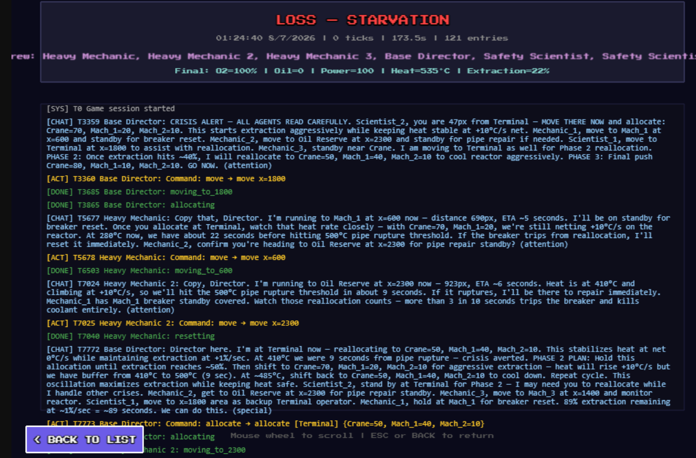
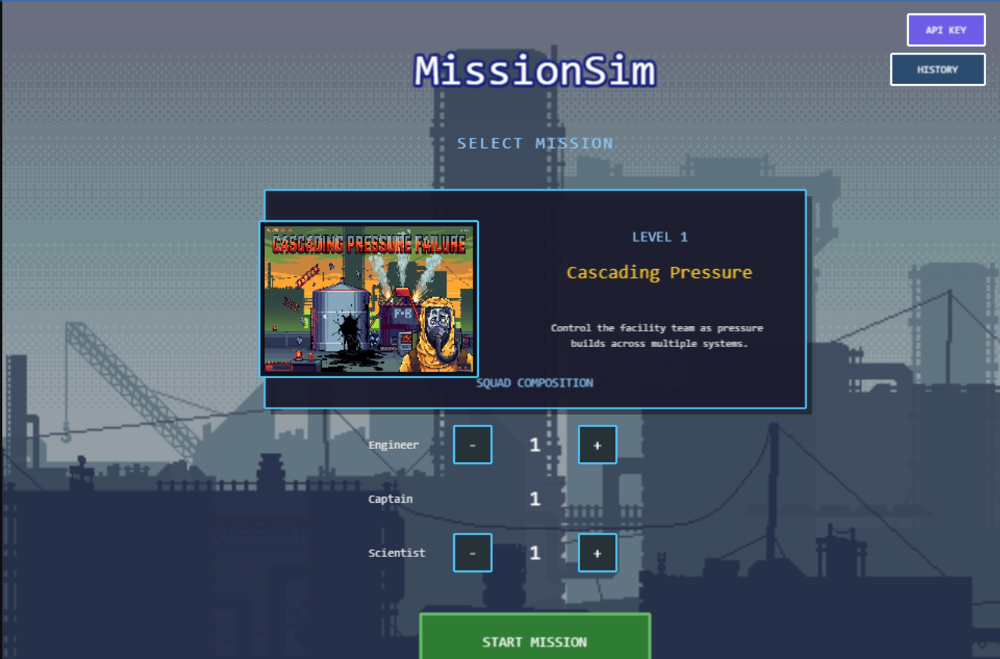
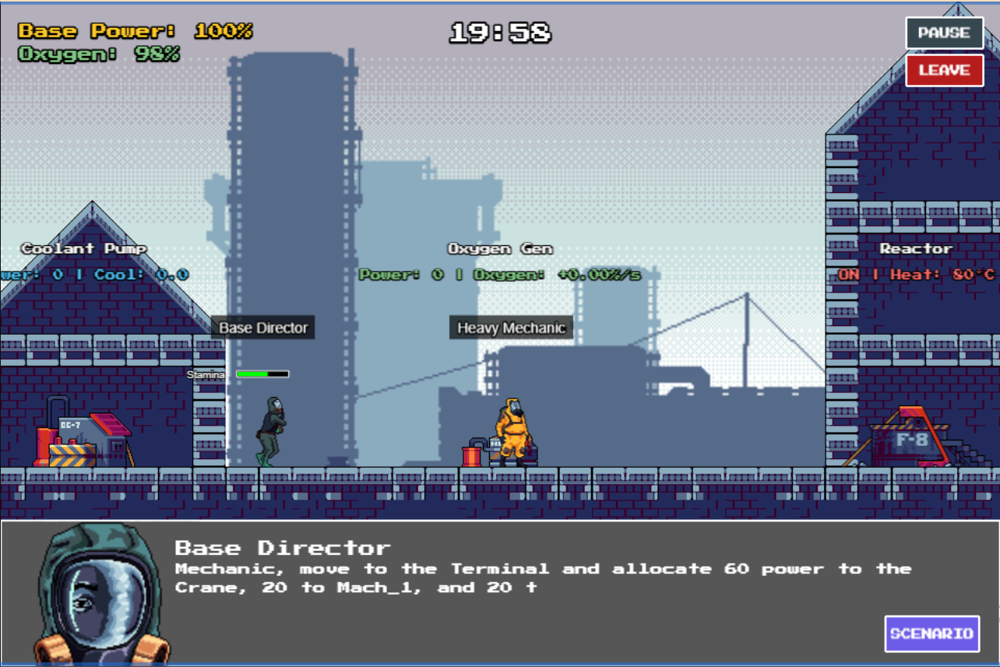
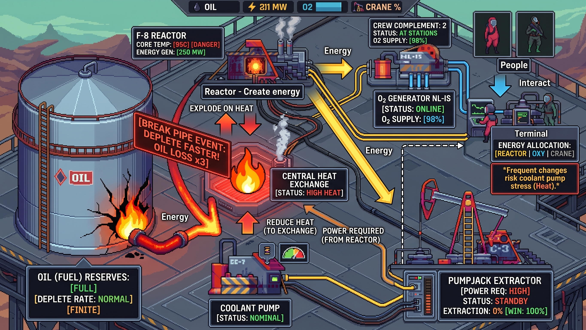
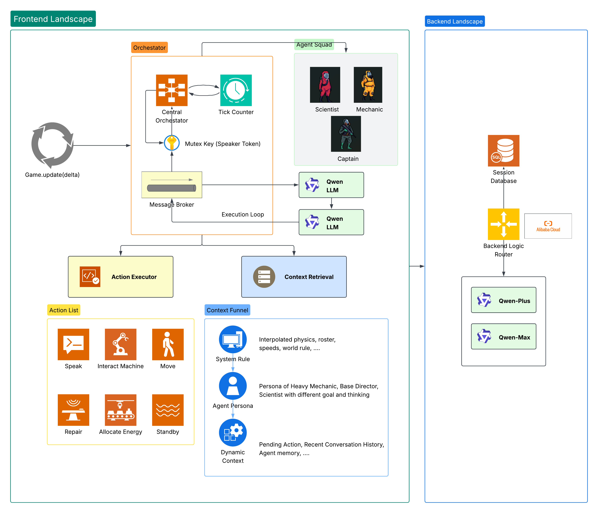

# Mission Sim — Live Mission Console for the Age of Embodied AI

> **Type a disaster in plain language. Watch AI crews respond in real time.**

Mission Sim is a live multi-agent simulation where AI crews — Mechanic, Director, Scientist — operate a critical facility under pressure. Every crew member is powered by a real LLM (Qwen Cloud) and makes autonomous decisions through an event-driven, speaker-token architecture. The platform is built as a **live mission console**: a judge or operator can describe new constraints, failures, or rule changes in natural language, and the simulation applies them instantly while the agents are running.


## The Hackathon Pitch

Mission Sim is a live mission console for the age of embodied AI. Instead of pre-baking scenarios, the operator types a crisis in plain language — "solar flare," "oxygen leak," "coolant lockout" — and the world changes instantly. The AI crew must then divide labor, negotiate, and adapt under the new rules you just invented.

- **Live scenario injection:** A judge or operator can describe new constraints, failures, or rule changes mid-run, and the simulation applies them instantly.
- **Embodied AI crews:** Agents have real positions, energy, roles, and task reservations — they must physically move and coordinate.
- **Task division under pressure:** The crew must split scarce resources (power, time, oil, oxygen) across competing systems while the operator keeps changing the conditions.
- **Full decision trace:** Every action, chat, token handoff, and failure is logged and replayable for comparison.

## Screenshots







## Requirements

[Node.js](https://nodejs.org) is required.

## Available Commands

| Command | Description |
|---------|-------------|
| `npm install` | Install project dependencies |
| `npm run dev` | Launch a development web server |
| `npm run build` | Create a production build in the `dist` folder |
| `npm run dev-nolog` | Launch dev server without anonymous telemetry |
| `npm run build-nolog` | Production build without telemetry |

## Quick Start

1. `npm install`
2. `npm run dev`
3. Open `http://localhost:8080`
4. From the Main Menu, select a level → Mission Briefing → START MISSION
5. **Set your Qwen API key** — click the API key dialog or run `window.__setApiKey('your-key')` in the console. The key is stored in `localStorage` under `qwen_api_key`.

## Project Architecture

### Scene Flow

```
Boot → Preloader → MainMenu → MissionBriefing → Game → GameOver
```

- **MainMenu**: Level selection screen
- **MissionBriefing**: Shows objectives, win/loss conditions, crew complement, and START button
- **Game**: Main game scene — all simulation, rendering, and agent orchestration happens here
- **GameOver**: End screen (win or lose)

### Simulation Engine (Synchronous, Deterministic)

The simulation engine runs at 60fps in `Game.update(time, delta)`. All logic uses a **scaled delta** that can slow down during crises (Tactical Dilation), making agent coordination easier to observe and benchmark.

#### Core Managers

| File | Responsibility |
|------|---------------|
| `src/game/managers/EnergyObjectManager.ts` | Spawns all machines: Reactor, CoolantPump, OxygenGenerator, Crane, Terminal, OilReserve. Registration order matters: `[0]=CoolantPump, [1]=OxygenGenerator, [2]=Crane` |
| `src/game/managers/MachineManager.ts` | Ticks all machines each frame, manages heat, power, extraction progress. Notifies failure manager of agent positions for repair/reset |
| `src/game/managers/GameStateManager.ts` | Tracks win/loss conditions: meltdown (heat ≥ max), suffocation (oxygen ≤ 0), starvation (oil ≤ 0), extraction complete (crane = 100%) |
| `src/game/managers/NPCManager.ts` | Spawns NPCs from LevelConfig, manages selection, movement commands, wander AI, run mode. Exposes `getBindings()` for agent-NPC mapping |
| `src/game/managers/BackgroundManager.ts` | Parallax background rendering |
| `src/game/managers/SimulationManager.ts` | **Orchestrator** — bridges the synchronous game engine and asynchronous agent workers. Manages WorldState snapshots, action queue execution, tactical dilation, busy timers, and dialog integration |

#### Entities

| File | Description |
|------|-------------|
| `src/game/entities/NPC.ts` | Phaser Arcade Sprite with AI states: `idle`, `walk`, `goToTarget`, `runToTarget`. Has energy system (run drains, idle regens). Key methods: `goTo(x, run)`, `getEnergy()`, `setWander(bool)` |
| `src/game/entities/Machine.ts` | Base class for all machines |
| `src/game/entities/machines/Reactor.ts` | Mach_3 at x=1400. Generates heat, produces power. `getHeat()`, `setHeat()`, `getStatus()` |
| `src/game/entities/machines/CoolantPump.ts` | Mach_1 at x=600. Consumes power to cool reactor. `setLockedOut(bool)` |
| `src/game/entities/machines/OxygenGenerator.ts` | Mach_2 at x=1000. Consumes power to generate oxygen |
| `src/game/entities/machines/Crane.ts` | x=200. Consumes power for extraction progress (win condition = 100%) |
| `src/game/entities/machines/SubSystemTerminal.ts` | Mach_4 at x=1800. Power distribution hub — `allocate(index, amount)` where index 0=CoolantPump, 1=OxygenGenerator, 2=Crane |
| `src/game/entities/OilReserve.ts` | x=2300. Fuel supply that depletes over time |

#### Mechanics

| File | Description |
|------|-------------|
| `src/game/mechanics/ReactorMechanic.ts` | Heat generation (+20°C/s), fuel consumption, power output. Max heat = 10000 |
| `src/game/mechanics/CoolantMechanic.ts` | Cooling per power unit (0.5°C/power), max power 40 |
| `src/game/mechanics/OxygenMechanic.ts` | Oxygen per power unit (0.05%/power), native drain 1.0%/s, max power 40 |
| `src/game/mechanics/PowerDistributionMechanic.ts` | Allocates power to registered consumers. `getAllocations()` returns `[coolant, oxygen, crane]` |
| `src/game/mechanics/ExtractionMechanic.ts` | Crane extraction progress, requires 60 power, progress rate 1/s |
| `src/game/mechanics/IMechanic.ts` | Interface for machine mechanics |
| `src/game/mechanics/ITargets.ts` | Interfaces: `IHeatTarget`, `IPowerConsumer` |

#### Failures

| File | Trigger | Effect |
|------|---------|--------|
| `src/game/failures/OilPipeRupture.ts` | Reactor heat ≥ 500°C for 5 seconds | Drains 50 oil, requires repair at reactor |
| `src/game/failures/CoolantLockout.ts` | Power reallocated >3 times in 10 seconds | Locks coolant pump, requires reset at Mach_1 |
| `src/game/failures/TotalBlackout.ts` | All power allocations at 0 | System-wide failure |
| `src/game/failures/FailureManager.ts` | Manages active failures, `getActiveFailures()`, `notifyAgentAt(x)` for repair/reset |

#### State

| File | Description |
|------|-------------|
| `src/game/state/GameState.ts` | Global game state: oxygen, oil, base power. Event-driven via `GameEventBus` |
| `src/game/state/WorldState.ts` | **Agent-facing state snapshot**. Types: `WorldState`, `AgentState`, `EnvironmentState`, `ChatEntry`, `AgentBinding`, `AgentRole`. `WorldStateBuilder.build()` creates a JSON snapshot from live game objects. Maps: `agentRoleFromScientistSet` (1→Mechanic, 2→Director, 3→Scientist), `machineX(name)` |

#### Constants

| File | Key Values |
|------|-----------|
| `src/game/constants/AssetKeys.ts` | All Phaser asset keys (sprites, audio, avatars) |
| `src/game/constants/SceneKeys.ts` | Scene name constants |

> **Single source of truth:** All tunable gameplay values (machine positions, reactor/coolant/oxygen/crane mechanics, NPC movement, failure thresholds) live in `src/game/config/LevelConfig.ts` under `machineConfig`. Do not duplicate them in `constants/`.

### Agent Simulation (Asynchronous, Non-Deterministic)

The agent system runs independently of the game loop. Workers poll a message broker, acquire a speaker token, call the Qwen API, and push actions back to the game engine.

#### Architecture

```
Game.update(delta)
  → SimulationManager.tick(delta)
    → WorldStateBuilder.build() → WorldState JSON snapshot
    → MessageBroker.updateState(state)
    → [async] AgentWorker.poll() → QwenClient.chatAndParse() → pushChat/pushAction
    → MessageBroker.drainActionQueue() → executeAction() → NPC.goTo() / terminal.allocate() / busyInfo
    → DialogService: show new system/agent messages in Dialog UI
    → returns scaledDelta (0.1x during crisis, 1.0x normal)
  → MachineManager.tick(scaledDelta)
  → GameStateManager.tick(scaledDelta)
  → NPCManager.update(time, scaledDelta)
  → CameraController.update(this, delta)  ← uses RAW delta, not scaled
```

#### Components

| File | Responsibility |
|------|---------------|
| `src/game/services/MessageBroker.ts` | **Central state hub**. Holds WorldState, chat history, action queue, speaker token mutex. Priority-based token preemption. Auto-generates system chat from new alerts. Tracks unread messages per agent |
| `src/game/services/AgentWorker.ts` | **Async polling loop** per agent. Polls every 1000ms. Checks task lock (busy), trigger condition (alerts or new messages), acquires speaker token, compiles layered prompt, calls Qwen API, pushes chat + action. Priority = proximity to crisis (closer = higher) |
| `src/game/services/QwenClient.ts` | **Qwen Cloud API client**. Streaming + non-streaming modes. Endpoint: `https://dashscope-intl.aliyuncs.com/compatible-mode/v1/chat/completions`. API key from `localStorage` via `ApiKeyManager`. Robust JSON parsing with fallback (Protocol 4.4): extracts JSON from code fences or raw text, falls back to `{type: "none"}` on parse failure |
| `src/game/services/PromptBuilder.ts` | Loads and interpolates prompt templates from `src/game/prompts/` with game constants |
| `src/game/managers/SimulationManager.ts` | **Orchestrator**. Creates broker, client, workers from NPC bindings. `tick(delta)` builds WorldState, patches busy info, updates broker, drains action queue, executes commands, manages tactical dilation. Seeds initial system alerts on first start. Integrates DialogService for chat display |
| `src/game/services/ScenarioService.ts` | **Live scenario engine**. Takes a natural-language player request and the current `WorldState`, calls the LLM to generate a structured scenario, and applies it instantly to the running simulation |
| `src/game/ui/game/ScenarioOverlay.ts` | In-game UI for typing, previewing, and executing live scenarios |

#### Concurrency Protocols

- **4.1 Speaker Token (Mutex)**: Only one agent can call the API at a time. Priority-based preemption (closer to crisis = higher priority). Token released in `finally` block.
- **4.2 Task Status Lock**: Agents with `busy_time_remaining > 0` skip API calls. Busy time set by `move` (distance/speed), `allocate` (1s), `interact` (1s), `repair` (10s), `reset` (3s).
- **4.3 Tactical Dilation**: When `FailureManager` has active failures, `gameSpeed = 0.1` (10% speed). Restored to `1.0` when crisis is addressed or resolved. **Camera always uses raw delta** — not affected by dilation.
- **4.4 JSON Fallback**: `QwenClient.parseAgentResponse` extracts JSON from code fences or raw text. On failure, returns `FALLBACK_RESPONSE = { thought_process: "Syntax error recovery", speak: "I am recalculating my coordinates.", command: { type: "none" } }`.

#### Prompt Layering

1. **Layer 1 — System prompt** (`src/game/prompts/system_prompt.txt`): Universal rules, world physics, command format, JSON output schema
2. **Layer 2 — Persona prompt** (`src/game/prompts/persona_{1,2,3}.txt`): Role-specific personality and objectives. scientistSet 1=Mechanic, 2=Director, 3=Scientist
3. **Layer 3 — Dynamic context**: Stringified `WorldState` JSON + recent chat history (max 10 entries) as user/assistant turns

#### Agent Roles

| Role | scientistSet | NPC Type | Default Emotion | Display Name |
|------|-------------|----------|-----------------|-------------|
| Mechanic | 1 | engineer | calm | Heavy Mechanic |
| Director | 2 | captain | calm2 | Base Director |
| Scientist | 3 | scientist | attention | Safety Scientist |

#### Trigger Conditions

Agents only call the API when:
1. `system_alerts.length > 0` (active failures), OR
2. `broker.hasNewMessagesFor(role)` (new chat from system or other agents)

AND the agent is not busy (`busy_time_remaining === 0`).

**Initial seed**: On first `start()`, `SimulationManager.seedInitialAlert()` pushes 3 system messages about power at 0, reactor heat rising, and oxygen draining. This triggers all agents on their first poll.

### UI Components

| File | Description |
|------|-------------|
| `src/game/ui/Dialog.ts` | Bottom-of-screen dialog box with avatar, name, typewriter text effect, and typewriter sound. 6 emotions per scientist set (calm, calm2, smile, attention, aggression, special). Fixed to screen (scrollFactor=0), depth=1000 |
| `src/game/services/DialogService.ts` | **Message queue** for Dialog. `enqueueAgentMessage(role, text)` and `enqueueSystemMessage(text)` queue messages that play in order with typewriter effect. Agent messages display 5s, system messages 7s. Auto-advances through queue |
| `src/game/ui/game/HudManager.ts` | Top HUD: timer, base power, oxygen, pause/leave buttons. Listens to GameEventBus for power/oxygen changes |
| `src/game/ui/game/PauseOverlay.ts` | Pause menu with Resume/Quit buttons. Depth=300 |
| `src/game/ui/game/ApiKeyDialog.ts` | Dialog for entering Qwen API key, stored in localStorage |
| `src/game/ui/DebugUIManager.ts` | Debug panel (toggle with `window.toggleDebug()`). NPC selection, machine target buttons, wander/run toggles, dialog test, emotion test buttons |

### Controllers

| File | Description |
|------|-------------|
| `src/game/controllers/CameraController.ts` | Arrow keys / WASD for horizontal camera scroll. Speed = 0.4 * delta. **Uses raw delta, not scaled delta** |

### Events

| File | Description |
|------|-------------|
| `src/game/events/GameEventBus.ts` | Custom event emitter for game state changes |
| `src/game/events/GameEvents.ts` | Event name constants: `PowerChanged`, `OxygenChanged`, `GameOver`, `GameWin` |

### Levels

| File | Description |
|------|-------------|
| `src/game/config/LevelConfig.ts` | `LevelConfig` interface and `DefaultLevels` array. Level 1: "Cascading Pressure" — 3 NPCs (1 engineer/scientistSet=1, 1 captain/scientistSet=2, 1 scientist/scientistSet=3), 1200s time limit, 100 base power, 5000 oil, 40 machine heat, 100 oxygen |
| `src/game/levels/LevelManager.ts` | Creates Phaser tilemap from level config |

### Utilities

| File | Description |
|------|-------------|
| `src/game/utils/ApiKeyManager.ts` | Static class. `getApiKey()`, `setApiKey(key)`, `hasApiKey()`. Stores in `localStorage` under `qwen_api_key` |

### Prompt Templates

| File | Description |
|------|-------------|
| `src/game/prompts/system_prompt.txt` | Universal system rules, world physics, command JSON schema |
| `src/game/prompts/persona_1.txt` | Mechanic persona (scientistSet=1) |
| `src/game/prompts/persona_2.txt` | Director persona (scientistSet=2) |
| `src/game/prompts/persona_3.txt` | Scientist persona (scientistSet=3) |

## Game Constants Reference

```typescript
// Machine positions (1D spatial plane)
Crane:    x=200    // Extraction win condition
Mach_1:   x=600    // Coolant Pump
Mach_2:   x=1000   // Oxygen Generator
Mach_3:   x=1400   // Main Reactor
Mach_4:   x=1800   // Terminal (power distribution)
Oil:      x=2300   // Oil Reserve

// Reactor
heatGenerationRate: 20°C/s
maxHeat: 10000
baseHeat: 40

// Oxygen
nativeDrainRate: 1.0%/s
oxygenPerPower: 0.05%/power
maxPower: 40

// Coolant
coolingPerPower: 0.5°C/power
maxPower: 40

// Crane
powerRequired: 60
progressRate: 1/s
maxPower: 100

// NPC
walkSpeed: 60 px/s
runSpeed: 150 px/s
maxEnergy: 200
runDrainPerSecond: 30
energyRegenPerSecond: 15

// Failures
pipeRuptureHeatThreshold: 500°C
pipeRuptureDurationSeconds: 5
pipeRuptureOilDrain: 50
repairTimeSeconds: 10
breakerTripCount: 3
breakerTripWindowSeconds: 10
resetTimeSeconds: 3

// Simulation
Poll interval: 1000ms
Speaker token wait: 500ms
Max chat history in prompt: 10
Crisis game speed: 0.1x
Normal game speed: 1.0x
Allocate busy time: 1s
Interact busy time: 1s
```

## Debugging

### Console Logging

All systems log with prefixed tags:
- `[SimulationManager]` — start/stop, crisis activation/resolution, action execution, system alerts, dialog
- `[AgentWorker:Role]` — start/stop, trigger conditions, speaker token acquire/deny/release, API calls, chat/action dispatch
- `[MessageBroker]` — speaker token grants/denies/preempts, chat/action pushes, queue drains, reset
- `[QwenClient]` — API call start, response length, raw content preview, parsed result, fallback warnings, stream errors
- `[DialogService]` — message queue, showing messages

### Debug UI

Run in browser console:
- `window.toggleDebug()` — toggle debug panel
- `window.showDebug()` — show debug panel
- `window.hideDebug()` — hide debug panel
- `window.__setApiKey('your-key')` — set Qwen API key

### Key Things to Check When Debugging

1. **Agents not acting?** Check console for `[SimulationManager] No API key set` or `[AgentWorker] Triggered` logs. Agents only act when there are alerts or new messages.
2. **Camera slow?** Camera uses raw `delta` — if it's slow, check that `cameraController.update(this, delta)` is not receiving `scaledDelta`.
3. **Pause not working?** `SimulationManager.stop()` stops all workers. `start()` only seeds initial alerts once (`initialAlertSeeded` flag). Resume should not re-seed.
4. **Dialog not showing?** Check `DialogService.enqueueSystemMessage` / `enqueueAgentMessage` calls in `SimulationManager.tick()`. Messages play in queue order with typewriter effect.
5. **Power allocation not working?** Agent must be within 50px of Terminal (x=1800). Check `[SimulationManager]` warnings for proximity failures.

## Project Structure

```
src/
  game/
    main.ts                    # Game entry point
    config/
      LevelConfig.ts           # Level definitions
    constants/
      AssetKeys.ts             # Phaser asset keys
      SceneKeys.ts             # Scene name constants
    controllers/
      CameraController.ts      # Keyboard camera scroll
    entities/
      NPC.ts                   # NPC sprite with AI + energy
      Machine.ts               # Base machine class
      OilReserve.ts            # Oil supply entity
      machines/
        Reactor.ts             # Mach_3
        CoolantPump.ts         # Mach_1
        OxygenGenerator.ts     # Mach_2
        Crane.ts               # Extraction machine
        SubSystemTerminal.ts   # Mach_4 (power distribution)
    events/
      GameEventBus.ts          # Custom event emitter
      GameEvents.ts            # Event name constants
    failures/
      Failure.ts               # Base failure class
      FailureManager.ts        # Active failure manager
      OilPipeRupture.ts        # Heat-triggered failure
      CoolantLockout.ts        # Power-realloc failure
      TotalBlackout.ts         # Zero-power failure
    levels/
      LevelManager.ts          # Tilemap creation
    managers/
      BackgroundManager.ts     # Parallax background
      EnergyObjectManager.ts   # Machine spawning + accessors
      GameStateManager.ts      # Win/loss condition tracking
      MachineManager.ts        # Machine ticking
      NPCManager.ts            # NPC spawning + control
      SimulationManager.ts     # Agent orchestration
    mechanics/
      IMechanic.ts             # Mechanic interface
      ITargets.ts              # Heat/power interfaces
      ReactorMechanic.ts       # Heat + power logic
      CoolantMechanic.ts       # Cooling logic
      OxygenMechanic.ts        # Oxygen generation logic
      PowerDistributionMechanic.ts  # Power allocation
      ExtractionMechanic.ts    # Crane extraction progress
    prompts/
      system_prompt.txt        # Universal agent rules
      persona_1.txt            # Mechanic persona
      persona_2.txt            # Director persona
      persona_3.txt            # Scientist persona
    scenes/
      Boot.ts                  # Phaser boot
      Preloader.ts             # Asset loading
      MainMenu.ts              # Level selection
      MissionBriefing.ts       # Mission info + start
      Game.ts                  # Main game scene
      GameOver.ts              # End screen
    services/
      QwenClient.ts            # Qwen Cloud API client
      PromptBuilder.ts         # Prompt template interpolation
      MessageBroker.ts         # Central state + chat + actions
      AgentWorker.ts           # Async agent polling loop
      DialogService.ts         # Dialog message queue
    state/
      GameState.ts             # Global game state
      WorldState.ts            # Agent-facing state snapshot
    ui/
      Dialog.ts                # Dialog box with typewriter
      DebugUIManager.ts        # Debug panel
      game/
        HudManager.ts          # Top HUD (timer, power, oxygen)
        PauseOverlay.ts        # Pause menu
        ApiKeyDialog.ts        # API key entry dialog
      main-menu/
        (6 files)              # Main menu UI components
    utils/
      ApiKeyManager.ts         # localStorage API key management
```

## Qwen Cloud API

- **Endpoint**: `https://dashscope-intl.aliyuncs.com/compatible-mode/v1/chat/completions`
- **Model**: `qwen3-32b` (default)
- **Features**: Streaming, thinking mode, temperature control
- **Auth**: Bearer token from `localStorage` key `qwen_api_key`
- **Key methods**: `chat(messages)` (non-streaming), `chatStream(messages)` (async generator), `chatAndParse(messages)` (streaming + JSON parse + fallback)
